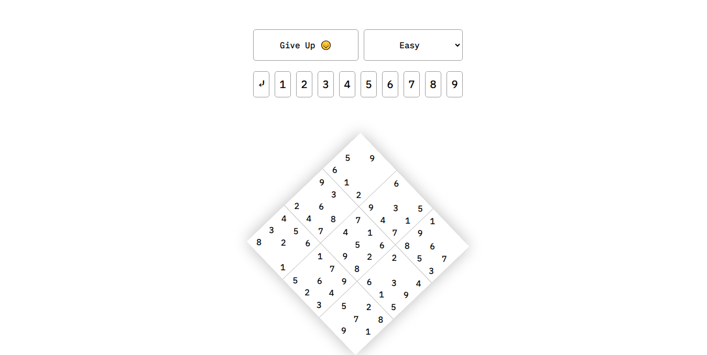

  <h1>mardoku</h1>
  <i>Minimal, functional and exciting Sudoku game from Martin Shaw</i>

## Want to try it out ?
https://martinshaw.github.io/mardoku

## How was it made?

As I didn't deem it necessary to use any frameworks for this basic game, I wrote it using a single vanilla JavaScript file. The HTML and CSS are also very basic.
